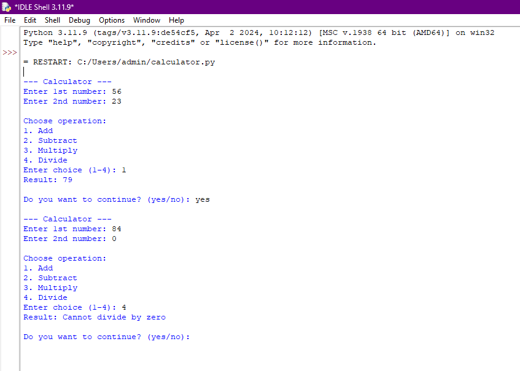
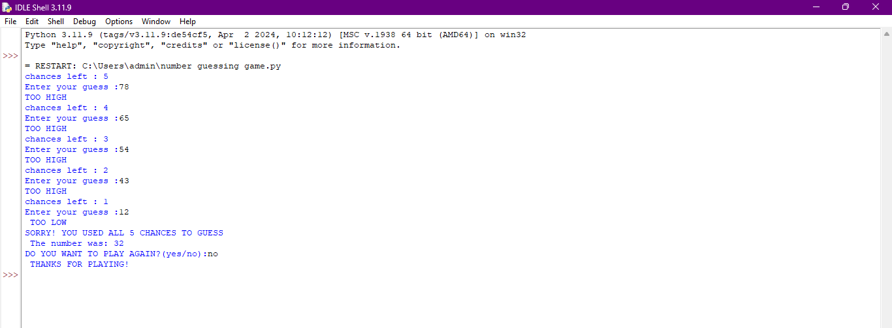
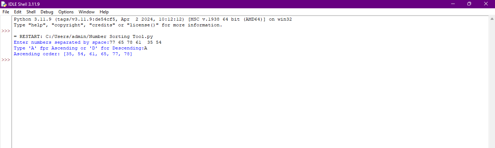

# CALCULATOR APP
This is a simple calculator application built using Python, based on concepts learned in class 11
## FEATURES
- Performs Addition
- Performs Subtraction
- Performs Multipliation
- Performs Division
- User-friendly input system
## OUTPUT SCREENSHOT

## AUTHOR
Lavanya Solanki

## NUMBER GUESSING GAME 
This is a simple number guessing game built using Python.
## FEATURES
- Random number between 1 to 100
- 5 chances to guess the number
- Shows hint like "TOO HIGH" or "TOO LOW"
- Play again option available
## HOW TO RUN:
Run the file 'number guessing game.py' in python
## OUTPUT SCREENSHOT 

## AUTHOR
Lavanya Solanki

## NUMBER SORTING TOOL
A simple Python program that takes multiple numbers as input and sorts them in ascending or descending order based on user choice.
## FEATURES
- Accepts multiple inputs from user
- Sorts numbers in ascending order
- Sorts numbers in descending order
- Easy and beginner-friendly
## OUTPUT SCREENSHOT

## AUTHOR 
Lavanya Solanki

